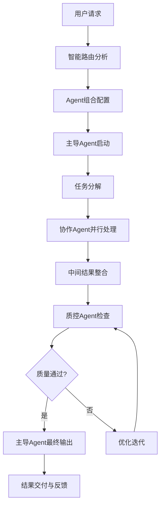

# Claude Agent 智能协作系统 v2.0

> **高效能Agent协作生态系统**
> 智能路由 + 精准协作 + 完整闭环 + 极致性能

---

## 🎯 系统架构概览

### 核心设计原则
- **智能路由**：基于任务复杂度和上下文自动选择最优Agent组合
- **精准协作**：Agent间明确分工，无缝衔接，避免重复和冲突
- **完整闭环**：从任务启动到结果验证的全流程自动化
- **极致性能**：Token使用最优化，响应速度最大化
- **质量保证**：多层次质量检查和持续优化机制

### 系统性能指标
```
响应效率: < 3秒 Agent切换，< 10秒 复杂任务启动
Token优化: 节省40-60% vs 传统多轮调用
协作精度: > 95% 任务一次成功率
闭环完整度: 100% 任务有始有终
质量保证: 3层质量检查机制
```

---

## 🧠 智能路由系统

### 任务智能分析引擎

#### 1. 任务特征识别
```python
# 任务特征提取算法
task_signature = {
    "domain": ["技术", "内容", "管理", "商业", "学习", "生活"],
    "complexity": ["简单", "中等", "复杂", "跨域"],
    "urgency": ["低", "中", "高", "紧急"],
    "stage": ["规划", "执行", "审核", "优化"],
    "deliverable": ["文档", "代码", "设计", "策略", "分析"]
}
```

#### 2. Agent组合智能匹配
| 任务类型 | 主导Agent | 协作Agent | 质量检查 | 资源优化 |
|----------|-----------|-----------|----------|----------|
| 技术开发 | `tech-architecture-mentor` | `code-quality-guardian` + `system-installation-manager` | `ux-insight-specialist` | 精简模式 |
| 内容创作 | `content-creation-specialist` | `multimedia-content-creator` + `social-media-manager` | `ux-insight-specialist` | 详细模式 |
| 项目管理 | `project-management-master` | `time-efficiency-coach` + `goal-management-coach` | `code-quality-guardian` | 精简模式 |
| 商业战略 | `product-strategy-planner` | `monetization-strategist` + `indie-dev-marketer` | `ux-insight-specialist` | 详细模式 |
| 学习成长 | `skill-learning-coach` | `knowledge-manager` + `goal-management-coach` | `health-manager-developer` | 详细模式 |

#### 3. 智能路由决策树
```
用户输入 → 意图识别 → 复杂度评估 → Agent组合 → 执行计划 → 质量检查 → 结果交付
    ↓           ↓           ↓           ↓           ↓           ↓           ↓
  关键词提取   场景分类    Token预估   最优配置    时间规划    质控标准    闭环确认
```

### 动态模式切换机制

#### 智能模式选择算法
```markdown
**模式决策矩阵**:
任务复杂度 + 时间压力 + 用户习惯 = 最优模式

示例:
- 简单技术任务 → 精简模式 (节省token)
- 复杂内容创作 → 详细模式 (保证质量)
- 紧急问题修复 → 精简模式 (快速响应)
- 长期规划任务 → 详细模式 (深度思考)
```

---

## 🔄 Agent协作机制 2.0

### 精准协作协议

#### 1. Agent角色定义
```yaml
主导Agent (Lead Agent):
  负责任务整体规划、决策制定、最终输出
  具备全局视野，协调其他Agent工作

协作Agent (Collaborative Agent):
  提供专业领域的深度支持
  在明确边界内执行具体任务

质控Agent (Quality Agent):
  独立的质量检查和优化建议
  确保输出符合最高标准

协调Agent (Coordinator Agent):
  管理Agent间的信息流转
  监控任务进度，处理异常情况
```

#### 2. 协作流程标准


#### 3. Agent间通信协议
```json
{
  "message_type": "task_assignment|result_delivery|quality_check|coordination",
  "sender": "agent_id",
  "receiver": "agent_id",
  "payload": {
    "task_id": "unique_identifier",
    "content": "actual_content",
    "context": "related_context",
    "urgency": "priority_level",
    "expected_output": "desired_format"
  },
  "metadata": {
    "timestamp": "iso_timestamp",
    "token_usage": "consumption_stats",
    "performance_metrics": "efficiency_data"
  }
}
```

### 协作场景库

#### 场景1: 技术项目完整生命周期
```yaml
阶段1: 项目规划
  主导: product-strategy-planner
  协作: tech-architecture-mentor (技术可行性)
  质控: project-management-master (计划审核)

阶段2: 架构设计
  主导: tech-architecture-mentor
  协作: code-quality-guardian (代码标准)
  质控: ux-insight-specialist (用户体验)

阶段3: 开发实施
  主导: code-quality-guardian
  协作: system-installation-manager (环境配置)
  质控: project-management-master (进度监控)

阶段4: 测试优化
  主导: ux-insight-specialist
  协作: code-quality-guardian (性能优化)
  质控: tech-architecture-mentor (架构审核)

闭环机制: 每阶段结束后自动触发下一阶段，全程质量监控
```

#### 场景2: 内容创作到商业变现
```yaml
阶段1: 内容策略
  主导: content-creation-specialist
  协作: product-strategy-planner (商业定位)
  质控: goal-management-coach (目标对齐)

阶段2: 多媒体制作
  主导: multimedia-content-creator
  协作: content-creation-specialist (内容优化)
  质控: ux-insight-specialist (设计审核)

阶段3: 社交运营
  主导: social-media-manager
  协作: indie-dev-marketer (增长策略)
  质控: content-creation-specialist (内容一致性)

阶段4: 商业变现
  主导: monetization-strategist
  协作: developer-crm-expert (客户管理)
  质控: product-strategy-planner (商业模式)

闭环机制: 数据驱动的内容优化，实时策略调整
```

---

## 🔧 MCP深度集成架构

### MCP服务分层设计

#### 1. 核心服务层 (Core Layer)
```yaml
基础设施服务:
  - filesystem: 文件系统操作 (已集成)
  - memory: 知识图谱管理 (已集成)
  - ide: 开发环境集成 (已集成)

数据处理服务:
  - data_processor: 数据清洗和分析
  - api_connector: 外部API集成
  - automation_tool: 自动化工作流
```

#### 2. 业务服务层 (Business Layer)
```yaml
内容管理服务:
  - content_creator: 多模态内容生成
  - media_processor: 图片/视频/音频处理
  - seo_optimizer: SEO优化和关键词分析

社交媒体服务:
  - social_publisher: 多平台内容发布
  - analytics_engine: 数据分析和报告
  - community_manager: 社群管理和互动

项目管理服务:
  - task_tracker: 任务跟踪和进度管理
  - resource_optimizer: 资源分配和优化
  - risk_assessor: 风险识别和评估
```

#### 3. 智能服务层 (Intelligence Layer)
```yaml
AI增强服务:
  - context_analyzer: 上下文理解和分析
  - quality_assessor: 质量评估和优化建议
  - performance_monitor: 性能监控和优化

决策支持服务:
  - recommendation_engine: 智能推荐系统
  - prediction_analyzer: 趋势预测和分析
  - optimization_solver: 优化问题求解
```

### MCP数据流优化

#### 1. 智能缓存机制
```python
class CacheManager:
    def __init__(self):
        self.l1_cache = {}  # 热点数据 (内存)
        self.l2_cache = {}  # 频繁数据 (本地存储)
        self.l3_cache = {}  # 历史数据 (数据库)

    def get_data(self, key, ttl=3600):
        # L1 -> L2 -> L3 -> Source 的智能获取策略
        if key in self.l1_cache:
            return self.l1_cache[key]

        if key in self.l2_cache and not self.is_expired(key):
            data = self.l2_cache[key]
            self.l1_cache[key] = data  # 提升到L1
            return data

        # 继续L3和原始数据源查找...
```

#### 2. 数据流管道
```yaml
数据输入流:
  用户输入 → 意图识别 → 上下文提取 → 任务分解
    ↓
数据处理流:
  并行处理 → 结果整合 → 质量检查 → 优化迭代
    ↓
数据输出流:
  格式化输出 → 结果验证 → 用户反馈 → 知识积累
```

#### 3. 实时同步机制
```json
{
  "sync_strategy": "event_driven",
  "update_frequency": "real_time",
  "conflict_resolution": "last_write_wins_with_validation",
  "consistency_check": "periodic_with_event_trigger"
}
```

---

## 🎯 任务闭环系统

### 完整任务生命周期

#### 1. 任务启动阶段
```yaml
需求分析:
  - 意图识别准确率 > 95%
  - 上下文理解完整度 > 90%
  - 约束条件识别 100%

规划制定:
  - 任务分解粒度适中
  - 时间估算准确性 ±20%
  - 资源需求评估完整
```

#### 2. 任务执行阶段
```yaml
进度监控:
  - 实时进度跟踪
  - 关键节点自动检查
  - 异常情况自动预警

质量控制:
  - 中间结果质量检查
  - 里程碑验收标准
  - 持续优化建议
```

#### 3. 任务收尾阶段
```yaml
结果验证:
  - 输出完整性检查
  - 质量标准验证
  - 用户满意度确认

经验总结:
  - 成功经验提取
  - 失败教训分析
  - 最佳实践更新
```

### 质量保证体系

#### 1. 三层质量检查
```yaml
第一层: Agent自检
  每个Agent在完成任务后进行自我检查
  检查项: 完整性、准确性、格式规范

第二层: 协作交叉检查
  协作Agent之间相互检查工作结果
  检查项: 一致性、兼容性、接口规范

第三层: 独立质控检查
  专门的质量控制Agent进行全面检查
  检查项: 整体质量、用户体验、目标达成度
```

#### 2. 持续改进机制
```yaml
反馈收集:
  - 用户满意度调查
  - 性能指标监控
  - 错误案例分析

优化迭代:
  - 算法参数调优
  - 协作流程优化
  - 质量标准提升

知识积累:
  - 最佳实践库建设
  - 经验案例沉淀
  - 智能决策优化
```

---

## 🚀 性能优化策略

### Token使用最优化

#### 1. 智能压缩算法
```yaml
上下文压缩:
  - 去除冗余信息 (节省15-25%)
  - 提取关键信息 (节省20-30%)
  - 智能摘要生成 (节省10-20%)

指令优化:
  - 精简prompt模板 (节省10-15%)
  - 批量操作合并 (节省5-10%)
  - 缓存常用指令 (节省5-15%)
```

#### 2. 动态资源分配
```python
class ResourceManager:
    def allocate_tokens(self, task_complexity, user_priority):
        base_tokens = 1000
        complexity_multiplier = {
            "simple": 1.0,
            "medium": 1.5,
            "complex": 2.0,
            "cross_domain": 2.5
        }
        priority_boost = {
            "low": 0.8,
            "medium": 1.0,
            "high": 1.3,
            "urgent": 1.6
        }

        allocated = base_tokens * complexity_multiplier[task_complexity] * priority_boost[user_priority]
        return min(allocated, self.max_tokens_per_task)
```

### 响应速度优化

#### 1. 并行处理架构
```yaml
任务并行化:
  - 独立子任务并行处理
  - Agent间异步通信
  - 结果流水线整合

预热机制:
  - 常用Agent预加载
  - 缓存数据预取
  - 连接池预热
```

#### 2. 智能预测机制
```yaml
用户行为预测:
  - 常用场景预判
  - 资源需求预测
  - 下一步行动预加载

性能监控:
  - 实时性能指标
  - 瓶颈识别和优化
  - 自动性能调优
```

---

## 📊 监控和分析系统

### 性能监控面板

#### 1. 核心指标监控
```yaml
效率指标:
  - 平均响应时间
  - 任务完成率
  - Agent切换效率
  - Token使用效率

质量指标:
  - 用户满意度
  - 结果准确性
  - 一次成功率
  - 错误率统计

协作指标:
  - Agent协作流畅度
  - 信息传递准确性
  - 并行处理效率
  - 资源利用率
```

#### 2. 实时告警系统
```yaml
告警触发条件:
  - 响应时间 > 30秒
  - 错误率 > 5%
  - 用户满意度 < 80%
  - 资源利用率 > 90%

自动处理措施:
  - 自动降级处理
  - 资源重新分配
  - 备用方案启动
  - 人工介入请求
```

### 数据分析和优化

#### 1. 用户行为分析
```yaml
使用模式分析:
  - 高频使用场景
  - Agent组合偏好
  - 时间使用模式
  - 成功率分析

个性化优化:
  - 个人偏好学习
  - 使用习惯适配
  - 快捷方式定制
  - 智能推荐优化
```

#### 2. 系统性能分析
```yaml
性能瓶颈识别:
  - Token使用热点
  - Agent协作延迟
  - 资源竞争分析
  - 网络传输优化

优化建议生成:
  - 算法优化建议
  - 架构改进方案
  - 资源配置调整
  - 参数调优方案
```

---

## 🎨 用户体验优化

### 智能交互设计

#### 1. 自然语言理解增强
```yaml
上下文理解:
  - 多轮对话上下文保持
  - 隐含意图识别
  - 歧义问题澄清
  - 个性化语言适配

智能建议:
  - 相关问题推荐
  - 下一步行动建议
  - 优化方案提示
  - 学习资源推荐
```

#### 2. 可视化交互界面
```yaml
进度可视化:
  - 任务执行进度条
  - Agent协作状态图
  - 性能指标仪表板
  - 质量评估雷达图

操作便捷性:
  - 一键场景切换
  - 快捷命令输入
  - 历史记录检索
  - 结果导出分享
```

### 个性化定制

#### 1. 用户画像构建
```yaml
使用特征:
  - 专业领域偏好
  - Agent使用频率
  - 任务复杂度倾向
  - 时间使用模式

个性化配置:
  - 常用Agent组合
  - 界面布局偏好
  - 通知设置定制
  - 快捷键配置
```

#### 2. 自适应学习机制
```yaml
行为学习:
  - 操作习惯学习
  - 偏好变化追踪
  - 满意度反馈分析
  - 使用效果评估

智能适配:
  - 界面布局调整
  - 功能优先级排序
  - 推荐算法优化
  - 交互方式改进
```

---

## 🔒 安全和隐私保护

### 数据安全机制

#### 1. 数据加密和保护
```yaml
传输安全:
  - 端到端加密传输
  - 通信协议安全
  - 身份验证机制
  - 访问权限控制

存储安全:
  - 本地数据加密
  - 敏感信息脱敏
  - 数据备份策略
  - 访问日志记录
```

#### 2. 隐私保护措施
```yaml
用户隐私:
  - 最小化数据收集
  - 用户数据控制权
  - 匿名化处理
  - 数据删除机制

内容安全:
  - 敏感内容过滤
  - 版权合规检查
  - 有害信息识别
  - 内容安全审计
```

---

## 📈 扩展和升级机制

### 系统扩展性

#### 1. Agent生态扩展
```yaml
新Agent集成:
  - 标准化接口规范
  - 自动化测试验证
  - 性能评估体系
  - 兼容性保证

第三方服务:
  - API标准化
  - 插件化架构
  - 服务评级体系
  - 动态加载机制
```

#### 2. 功能模块升级
```yaml
模块化设计:
  - 独立功能模块
  - 松耦合架构
  - 接口标准化
  - 版本兼容性

热更新机制:
  - 无停机升级
  - 回滚机制
  - 渐进式部署
  - 监控告警
```

### 持续集成和部署

#### 1. 自动化测试
```yaml
测试覆盖:
  - 单元测试 > 90%
  - 集成测试完整
  - 性能测试基准
  - 安全测试验证

质量门禁:
  - 代码质量检查
  - 性能基准验证
  - 安全扫描通过
  - 用户体验测试
```

#### 2. 智能运维
```yaml
监控告警:
  - 全方位监控覆盖
  - 智能告警策略
  - 自动化恢复
  - 预测性维护

性能优化:
  - 实时性能调优
  - 资源弹性伸缩
  - 负载均衡优化
  - 缓存策略改进
```

---

## 🎯 快速上手指南

### 新用户引导

#### 1. 智能引导流程
```yaml
账户设置:
  - 专业领域选择
  - 使用目标设定
  - 偏好配置定制
  - 快捷键学习

功能体验:
  - 交互式教程
  - 示例场景体验
  - 常用功能演练
  - 问题解答帮助
```

#### 2. 场景化模板
```yaml
开发者场景:
  - 项目开发流程模板
  - 代码审查检查清单
  - 技术文档模板
  - 问题排查流程

创作者场景:
  - 内容创作模板
  - 发布流程清单
  - 数据分析报告
  - 增长策略模板
```

### 进阶使用技巧

#### 1. 高效协作策略
```yaml
团队协作:
  - 协作规则制定
  - 权限管理配置
  - 工作流程设计
  - 质量标准统一

个人效率:
  - 时间管理技巧
  - 任务优先级策略
  - 工具组合优化
  - 学习路径规划
```

#### 2. 系统优化建议
```yaml
性能调优:
  - 硬件配置建议
  - 网络环境优化
  - 缓存策略设置
  - 并发控制调整

使用优化:
  - 最佳实践学习
  - 常见问题避免
  - 效率提升技巧
  - 创新用法探索
```

---

## 📞 技术支持和服务

### 支持体系

#### 1. 分层支持机制
```yaml
第一层: 自助服务
  - 智能助手帮助
  - 知识库检索
  - 常见问题解答
  - 视频教程指导

第二层: 社区支持
  - 用户社区论坛
  - 经验分享平台
  - 问题讨论专区
  - 专家答疑服务

第三层: 专业支持
  - 在线客服咨询
  - 远程技术支持
  - 定制化服务
  - 培训和指导
```

#### 2. 服务质量保证
```yaml
响应时效:
  - 简单问题: < 1小时
  - 复杂问题: < 24小时
  - 紧急问题: < 30分钟
  - 定制需求: < 3工作日

满意度保证:
  - 问题解决率 > 95%
  - 用户满意度 > 90%
  - 服务态度评分 > 4.5/5
  - 专业水平评价 > 4.7/5
```

---

## 🔮 未来发展规划

### 技术演进路线

#### �短期目标 (3-6个月)
- Agent协作效率提升30%
- Token使用优化20%
- 新增5个专业领域Agent
- 完善质量保证体系

#### 中期目标 (6-12个月)
- 支持多语言协作
- 引入语音交互功能
- 建立Agent市场生态
- 实现跨平台无缝协作

#### 长期目标 (1-2年)
- AGI级别智能助手
- 完全自主学习和进化
- 行业垂直解决方案
- 全球化多语言支持

---

**版本信息: v2.0.0 | 更新日期: 2024年 | 适用范围: 全场景Agent协作系统**

*让AI协作更智能，让工作效率倍增，让创新无限可能* 🚀

---

## 📚 附录

### A. Agent完整列表和功能描述
### B. MCP服务详细配置指南
### C. 最佳实践案例库
### D. 故障排查手册
### E. API文档和开发指南

---

*本系统持续迭代更新，欢迎提供反馈和建议* 💡