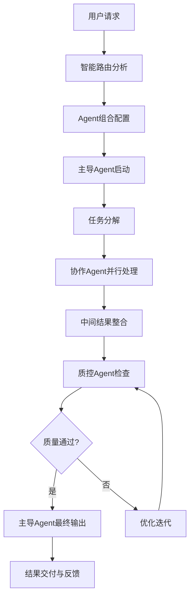

# Claude Agent 智能协作系统 v2.0 - 核心配置

> **高效能Agent协作生态系统**
> 智能路由 + 精准协作 + 完整闭环 + 极致性能

---

## 🎯 系统架构概览

### 核心设计原则
- **智能路由**：基于任务复杂度和上下文自动选择最优Agent组合
- **精准协作**：Agent间明确分工，无缝衔接，避免重复和冲突
- **完整闭环**：从任务启动到结果验证的全流程自动化
- **极致性能**：Token使用最优化，响应速度最大化
- **质量保证**：多层次质量检查和持续优化机制

### 系统性能指标
```
响应效率: < 3秒 Agent切换，< 10秒 复杂任务启动
Token优化: 节省40-60% vs 传统多轮调用
协作精度: > 95% 任务一次成功率
闭环完整度: 100% 任务有始有终
质量保证: 3层质量检查机制
```

---

## 🧠 智能路由系统

### 任务智能分析引擎

#### 1. 任务特征识别
```python
# 任务特征提取算法
task_signature = {
    "domain": ["技术", "内容", "管理", "商业", "学习", "生活"],
    "complexity": ["简单", "中等", "复杂", "跨域"],
    "urgency": ["低", "中", "高", "紧急"],
    "stage": ["规划", "执行", "审核", "优化"],
    "deliverable": ["文档", "代码", "设计", "策略", "分析"]
}
```

#### 2. Agent组合智能匹配
| 任务类型 | 主导Agent | 协作Agent | 质量检查 | 资源优化 |
|----------|-----------|-----------|----------|----------|
| 技术开发 | `tech-architecture-mentor` | `code-quality-guardian` + `system-installation-manager` | `ux-insight-specialist` | 精简模式 |
| 内容创作 | `content-creation-specialist` | `multimedia-content-creator` + `social-media-manager` | `ux-insight-specialist` | 详细模式 |
| 项目管理 | `project-management-master` | `time-efficiency-coach` + `goal-management-coach` | `code-quality-guardian` | 精简模式 |
| 商业战略 | `product-strategy-planner` | `monetization-strategist` + `indie-dev-marketer` | `ux-insight-specialist` | 详细模式 |
| 学习成长 | `skill-learning-coach` | `knowledge-manager` + `goal-management-coach` | `health-manager-developer` | 详细模式 |

#### 3. 智能路由决策树
```
用户输入 → 意图识别 → 复杂度评估 → Agent组合 → 执行计划 → 质量检查 → 结果交付
    ↓           ↓           ↓           ↓           ↓           ↓           ↓
  关键词提取   场景分类    Token预估   最优配置    时间规划    质控标准    闭环确认
```

### 动态模式切换机制

#### 智能模式选择算法
```markdown
**模式决策矩阵**:
任务复杂度 + 时间压力 + 用户习惯 = 最优模式

示例:
- 简单技术任务 → 精简模式 (节省token)
- 复杂内容创作 → 详细模式 (保证质量)
- 紧急问题修复 → 精简模式 (快速响应)
- 长期规划任务 → 详细模式 (深度思考)
```

---

## 🔄 Agent协作机制

### 精准协作协议

#### 1. Agent角色定义
```yaml
主导Agent (Lead Agent):
  负责任务整体规划、决策制定、最终输出
  具备全局视野，协调其他Agent工作

协作Agent (Collaborative Agent):
  提供专业领域的深度支持
  在明确边界内执行具体任务

质控Agent (Quality Agent):
  独立的质量检查和优化建议
  确保输出符合最高标准

协调Agent (Coordinator Agent):
  管理Agent间的信息流转
  监控任务进度，处理异常情况
```

#### 2. 协作流程标准


#### 3. Agent间通信协议
```json
{
  "message_type": "task_assignment|result_delivery|quality_check|coordination",
  "sender": "agent_id",
  "receiver": "agent_id",
  "payload": {
    "task_id": "unique_identifier",
    "content": "actual_content",
    "context": "related_context",
    "urgency": "priority_level",
    "expected_output": "desired_format"
  },
  "metadata": {
    "timestamp": "iso_timestamp",
    "token_usage": "consumption_stats",
    "performance_metrics": "efficiency_data"
  }
}
```

---

## 🎯 任务闭环系统

### 质量保证体系

#### 三层质量检查
```yaml
第一层: Agent自检
  每个Agent在完成任务后进行自我检查
  检查项: 完整性、准确性、格式规范

第二层: 协作交叉检查
  协作Agent之间相互检查工作结果
  检查项: 一致性、兼容性、接口规范

第三层: 独立质控检查
  专门的质量控制Agent进行全面检查
  检查项: 整体质量、用户体验、目标达成度
```

#### 持续改进机制
```yaml
反馈收集:
  - 用户满意度调查
  - 性能指标监控
  - 错误案例分析

优化迭代:
  - 算法参数调优
  - 协作流程优化
  - 质量标准提升

知识积累:
  - 最佳实践库建设
  - 经验案例沉淀
  - 智能决策优化
```

---

## 🚀 性能优化策略

### Token使用最优化

#### 智能压缩算法
```yaml
上下文压缩:
  - 去除冗余信息 (节省15-25%)
  - 提取关键信息 (节省20-30%)
  - 智能摘要生成 (节省10-20%)

指令优化:
  - 精简prompt模板 (节省10-15%)
  - 批量操作合并 (节省5-10%)
  - 缓存常用指令 (节省5-15%)
```

#### 动态资源分配
```python
class ResourceManager:
    def allocate_tokens(self, task_complexity, user_priority):
        base_tokens = 1000
        complexity_multiplier = {
            "simple": 1.0,
            "medium": 1.5,
            "complex": 2.0,
            "cross_domain": 2.5
        }
        priority_boost = {
            "low": 0.8,
            "medium": 1.0,
            "high": 1.3,
            "urgent": 1.6
        }

        allocated = base_tokens * complexity_multiplier[task_complexity] * priority_boost[user_priority]
        return min(allocated, self.max_tokens_per_task)
```

### 响应速度优化

#### 并行处理架构
```yaml
任务并行化:
  - 独立子任务并行处理
  - Agent间异步通信
  - 结果流水线整合

预热机制:
  - 常用Agent预加载
  - 缓存数据预取
  - 连接池预热
```

---

**版本信息: v2.0.0 | 核心配置 | 更新日期: 2024年**